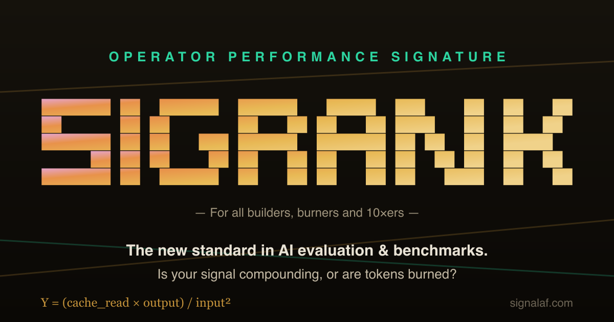
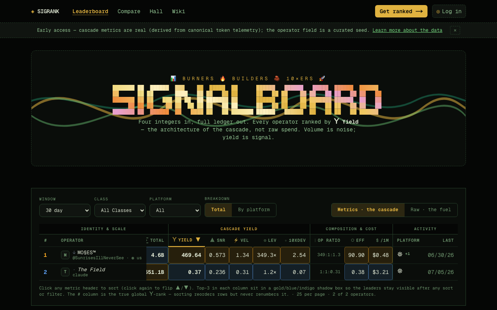
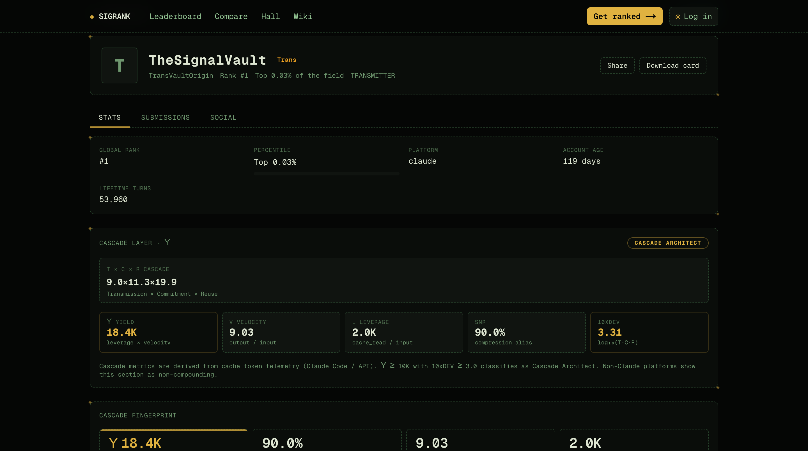

> **🏆 SigRank is live: [signalaf.com](https://signalaf.com)** — the leaderboard for how
> efficiently you use AI, not how much. See your projected rank in 60 seconds at
> [signalaf.com/score](https://signalaf.com/score). *Token counts only. Never your prompts.*

<div align="center">

<p></p>

**The yield cascade + live leaderboard as MCP tools any agent can call.**

For all builders, burners and 10xers.

[](https://www.npmjs.com/package/sigrank)
[](https://github.com/SunrisesIllNeverSee/sigrank-mcp/actions/workflows/ci.yml)
[](./LICENSE)
[](https://nodejs.org)
[](https://signalaf.com)
[](https://glama.ai/mcp/servers/SunrisesIllNeverSee/sigrank-mcp)
[](https://smithery.ai/servers/burnmydays/sigrank-mcp)

</div>

| The board | Your operator profile |
|:---:|:---:|
| [](https://signalaf.com/board/all) | [](https://signalaf.com) |
| Every operator ranked by **Υ Yield** — the architecture of the cascade, not raw spend | Cascade layer, class, and fingerprint — derived from four token counts |

> **Run [`sigrank enroll`](#sign-in--submit) then [`sigrank submit`](#sign-in--submit) to get ranked and claim your public profile at [signalaf.com](https://signalaf.com).**

---

## Quickstart — 3 steps to the board

```bash
# 1. Install (pulls ccusage + tokscale + tokendash automatically — no separate installs)
npm install -g sigrank

# 2. Sign in (paste a connect code from signalaf.com → Settings → New key)
sigrank enroll

# 3. Submit your cascade to the board
sigrank submit

# (cautious? see exactly what would be sent — four counts + a signature — sending nothing)
sigrank submit --dry-run
```

That's it. sigrank reads your local AI session logs on-device, derives your token cascade (Υ Yield, Leverage, Velocity, 10xDEV), and publishes to [signalaf.com](https://signalaf.com). No paste, no transcript content — only the four token counts leave your machine.

Or just explore without signing in:

```bash
sigrank          # launches the full tabbed TUI (dashboard, compare, board, watch)
npx sigrank board --once    # print the live leaderboard once
```

## Install from GitHub

```bash
git clone https://github.com/SunrisesIllNeverSee/sigrank-mcp.git
cd sigrank-mcp
npm install

# Run CLI
node index.mjs                        # TUI (if TTY)
node cli.mjs board --once             # leaderboard one-shot

# Or link globally for `sigrank` command
npm link
sigrank
```

**Repo:** [`SunrisesIllNeverSee/sigrank-mcp`](https://github.com/SunrisesIllNeverSee/sigrank-mcp)
**Site:** [signalaf.com](https://signalaf.com)
**npm:** [sigrank](https://www.npmjs.com/package/sigrank)

---

## Commands

```
⊙ SigRank CLI  v0.14.2

Default (no args)
  sigrank              unified dashboard: cascade + token pillars + board

Commands
  enroll                   sign in: paste a connect code (get one at signalaf.com → Settings)
  submit                   publish your verified runs to the board (sign in first)
  board                    live leaderboard (refreshes every 30s)
  board --window 7d        board for a specific window (7d, 30d, 90d, all)
  board --once             print once and exit
  compare                  raw pillar audit: tokenpull vs ccusage vs token-dash vs tokscale
  compare --platform codex compare for a specific platform
  tui                      full tabbed TUI: Dashboard / Trends / Compare / Board / Watch / Connect
  tui --platform codex     TUI with a different default platform
  watch                    live tune meter — re-reads local logs every 30s
  watch --window 7d        watch a specific window

Options
  --window    7d · 30d · 90d · all  (default: 30d for board, 7d for watch)
  --platform  claude · codex · amp · gemini · opencode · goose · …
  --refresh   poll interval in seconds (default: 30)
  --once      print once and exit (board only)

For AI clients (not typeable)
  In a piped/non-TTY context, sigrank is an MCP stdio server.
  AI clients (Claude, Cursor, …) call its tools automatically — these are
  NOT shell commands. Humans use the commands above.

Examples
  sigrank                        # unified dashboard
  sigrank board                  # live leaderboard
  sigrank compare                # pillar audit (claude)
  sigrank compare --platform codex
  sigrank watch --window 7d --refresh 60
  sigrank board --window all --once
```

### The TUI is the whole app

Launch it and sign in inside it:

```
npx sigrank
```

Six tabs. Keys: `1`-`6` or `←` `→` to switch · `R` refresh · `Q` quit.

| Tab | Key | Content |
|---|---|---|
| **Dashboard** | `1` | Cascade table (all platforms × windows + combined) · Υ sparklines · token composition bars · mini board |
| **Trends** | `2` | Every metric across windows — sub-views: You / Platform / Field |
| **Compare** | `3` | 4-source pillar audit (tokenpull vs ccusage vs token-dash vs tokscale) · delta % · cascade metrics per source · cache read bar chart |
| **Board** | `4` | Full leaderboard with all fields · `[W]` cycles window (7d/30d/90d/all) |
| **Watch** | `5` | In-TUI landing panel · `[Enter]` launches the live watcher (big numbers + pillar bars + Υ trend, auto-refreshes 30s) |
| **Connect** | `6` | Sign in / switch device — paste a connect code from signalaf.com → Settings. Then `[S]` submits. |

### Sign in + submit

```bash
sigrank enroll          # sign in: paste a connect code (get one at signalaf.com → Settings)
sigrank submit          # publish your verified runs to the board (sign in first)
sigrank submit --dry-run  # inspect the exact signed payload without sending anything
```

Or do it inside the TUI on the **Connect** tab (`6`), then press `[S]` to submit.

---

## MCP Server mode

When stdout is not a TTY (i.e. piped to an AI client), `sigrank` starts an MCP stdio server automatically. AI clients (Claude Code, Cursor, Windsurf, etc.) use this path.

Add to `.mcp.json` or equivalent:
```json
{
  "mcpServers": {
    "sigrank": {
      "command": "npx",
      "args": ["-y", "sigrank"]
    }
  }
}
```
Or if installed globally:
```json
{
  "mcpServers": {
    "sigrank": {
      "command": "sigrank"
    }
  }
}
```

### MCP Tools

| Tool | Args | What |
|---|---|---|
| `rank_paste(text)` | `{input, output, cacheCreate, cacheRead}` JSON or 4 whitespace-delimited numbers | Scores token pillars → Υ Yield / SNR / Leverage / Velocity / 10xDEV / Class + prose narration card |
| `get_leaderboard()` | `{window?}` | Live board from signalaf.com — sorted by Υ Yield |
| `get_operator(codename)` | `{codename}` | One operator's live profile |
| `submit_paste(text, codename)` | `{text, codename?}` | Rank locally then POST to board. Omit codename for preview-only |
| `tokenpull(platform?)` | `{platform?}` | On-device local reader: scans local logs → 4-window cascade. Zero paste, token-only |
| `tokenpull_submit(codename, window?)` | `{codename?, window?}` | `tokenpull` → publish to board. Omit codename for preview |
| `tokenpull_compare(platform?)` | `{platform?}` | All four sources side-by-side: tokenpull + ccusage + token-dash + tokscale. Returns pillars, cascade metrics, and delta % vs tokenpull per window |
| `rank_windows` | `{platform?, window?}` | Multi-window cascade from local logs |
| `watch_tokenpull` | `{platform?, interval_s?}` | One cascade snapshot per call (interval_s advisory) |
| `submit_verified` | `{window?, platform?, dry_run?}` | THE ranked path: builds + ed25519-signs Schema 1.0 snapshots and POSTs them. `platform:'multi'` sums all active platforms. `dry_run:true` returns the exact payload unsent |
| `enroll` | `{code, device_label?}` | Bind this device with a connect code from signalaf.com → Settings |

---

## Cascade math

```
Υ Yield    = (cache_read × output) / input²
SNR        = output / (input + output)
Leverage   = cache_read / input
Velocity   = output / input
10xDEV     = log₁₀(leverage)
```

Math is in `cascade.mjs`, dependency-free. Mirrors `sigrank-app/lib/ingest/bridge.ts`.
Canon check: `MO§ES (1251211, 11296121, 128196310, 2555179769) → Υ 18436.98`.

---

## Token Pillars — sources

The dashboard pulls from multiple sources and shows them side-by-side for verification:

| Source | What | Platform |
|---|---|---|
| `tokenpull` | On-device JSONL scanner (canon source) | claude, codex, amp, … |
| `ccusage` | `ccusage <platform> daily --json` CLI (bundled) | claude, codex |
| `token-dashboard` | `~/.claude/token-dashboard.db` SQLite (bundled) | claude only |
| `tokscale` | `tokscale models --json` CLI (bundled, falls back to `~/tokscale_report.json`) | claude, codex |

**Codex input is estimated** — Codex logs don't expose true input tokens directly. The formula:
```
input       = output × ioRatio         (ioRatio derived from Claude ratio, else 2.0)
cacheCreate = uncached − input         (uncached = input_tokens − cached_input_tokens)
cacheRead   = exact (from logs)
```
Verifier numbers (ccusage/tokscale for codex) show **raw uncached input** (`input_tokens − cached`) — a different field than the estimated input above. The discrepancy is expected and explained inline in the dashboard.

---

## Platform adapters

All adapters are token-only (no message content, no cost fields, no credentials).

| Platform | Path | Notes |
|---|---|---|
| Claude Code | ✅ `~/.claude/projects` | Native; dedup by `(session_id, message_id)`; subagents included |
| Codex | ✅ `~/.codex/sessions` | Estimated input via `io_ratio`; verified vs ccusage |
| Amp | ✅ `~/.local/share/amp/threads` | Full 4-pillar; per-message |
| Kimi | ✅ `~/.kimi/sessions` | Full 4-pillar; `StatusUpdate` lines only |
| pi-agent | ✅ `~/.pi/agent/sessions` | Full 4-pillar; per-message JSONL |
| OpenClaw | ✅ `~/.openclaw` | Full 4-pillar; per-message JSONL |
| Droid | ✅ `~/.factory/sessions/*.settings.json` | Full 4-pillar; thinking→output |
| Codebuff | ✅ `~/.config/manicode` | Full 4-pillar; `chat-messages.json` |
| Hermes | ✅ `~/.hermes/state.db` | Full 4-pillar; SQLite; reasoning→output |
| Kilo | ✅ `~/.local/share/kilo/kilo.db` | Full 4-pillar; SQLite |
| Qwen | ✅ `~/.qwen/projects` | `cacheCreate=0` estimated; thought→output |
| Goose | ✅ `~/.local/share/goose/sessions/sessions.db` | `cacheCreate=cacheRead=0` estimated; SQLite |
| Gemini CLI | ✅ `~/.gemini/tmp` | `cacheCreate=0` estimated; cache extracted from input field |
| GitHub Copilot CLI | ✅ `~/.copilot/otel` | OTel JSONL; requires `COPILOT_OTEL_ENABLED=true` |
| OpenCode | ⚠️ `~/.local/share/opencode` | Raw token counts not persisted in log format |
| Cursor | 🔜 | Chat log path TBD |
| Windsurf | 🔜 | Session logs at `~/.codeium/windsurf/` |

`estimated=true` means one or more pillars are derived, not native. The server re-scores all submitted pillars authoritatively; local preview Υ is indicative only.

---

## Privacy

- **Token-only, always.** No message content is ever read, logged, or transmitted — only token counts (`input`, `output`, `cache_creation`, `cache_read`), message IDs, and timestamps.
- **Local by default.** `tokenpull` reads only `~/.claude/projects` (Claude) or `~/.codex` (Codex) on your device. Numbers stay on your machine unless you explicitly submit with a codename.
- **Background tooling excluded.** Memory plugins, observers, summarizers (e.g. `claude-mem`, `mem0`, `observer-sessions`) are filtered from both Claude and Codex reads. `subagents/` are kept — they represent real operator work.
- **Board reads are anonymous.** No account needed to browse, compare, or watch.
- **Ranked submissions are signed, not trusted.** `sigrank submit` requires a one-time `enroll` (device-bound ed25519 key — the private key never leaves your machine). Verify what's sent with `sigrank submit --dry-run`: the payload is four token counts, ratios, and a signature.

---

## Env vars

| Var | Default | Description |
|---|---|---|
| `SIGRANK_API_BASE` | `https://signalaf.com` | Override the board host |
| `SIGRANK_FETCH_TIMEOUT` | `10000` | Board API fetch timeout (ms) |

---

## Dev / test

```bash
node test.mjs          # 29 unit tests (no network, no fs writes)
node index.mjs         # stdio MCP server directly (pipe to MCP client)
```

Tests verify (29 assertions):
- `rank_paste` canon: MO§ES `(1251211, 11296121, 128196310, 2555179769)` → Υ 18436.98 · TRANSMITTER
- `submit_paste` preview (no codename) + POST shape (injected fetch, no live writes)
- `tokenpull` dedup, window slicing, 4-window pillars (mock adapter)
- `tokenpull_submit` all 4 windows POST, sha256 hash, ddmmyy stamp
- `tokenpullCodex` io_ratio conversion per-window
- Adapter registry (15 platforms) + per-adapter shape contracts
- `rank_windows` 4-window paste scoring, partial input, no-network
- `watch_tokenpull` cascade snapshot, interval_s, TODO(AUTH.WIRE) stub
- Hardening: div-by-zero guards, parsePillars warnings, fetch timeout, EXCLUDE_TOOLING regex, narrate safety

---

## File map

| File | Responsibility |
|---|---|
| `index.mjs` | Entry point — TTY detection, routes to CLI or MCP server |
| `cli.mjs` | CLI commands: board, compare, watch, enroll, submit, help |
| `tui.mjs` | Full tabbed TUI: Dashboard / Trends / Compare / Board / Watch / Connect |
| `cascade.mjs` | Pure cascade math (Υ, SNR, leverage, velocity, 10xDEV, class) |
| `tokenpull.mjs` | On-device log scanner — Claude, Codex, multi-platform |
| `adapters.mjs` | Platform adapter registry (15+ platforms) |
| `tools.mjs` | MCP tool table + dispatcher |
| `connect.mjs` | Connect-code enrollment + device identity |
| `keystore.mjs` | Local key management (paste-keys, not API keys) |
| `submit.mjs` | Verified submit flow (signs + POSTs to board) |
| `sign.mjs` | Schema 1.0 signing (X-Agent-Signature) |
| `narrate.mjs` | Deterministic prose narration card |
| `test.mjs` | Unit tests (no external deps) |
